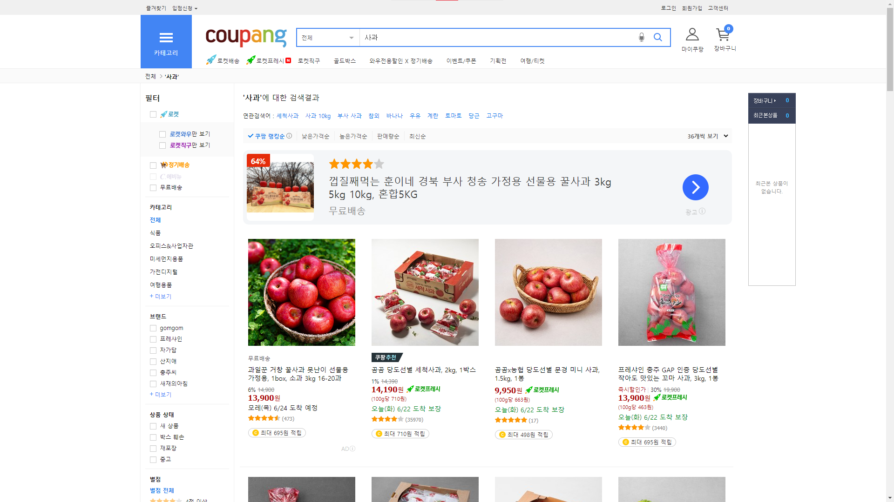

  


### 지원하는 사이트

__쿠팡 ([쿠팡! (coupang.com)](https://www.coupang.com/))__



- 스크래핑 가능 항목

  - 제품 이미지
  - 제품명
  - 가격
  - 별점
  - 해당 제품 판매 url

- 스크래핑 갯수

  이미지: 8개
  
  이외의 항목: 36개


### 사용방법

__pip 설치__

```python
pip install git+https://github.com/hojp7874/web-scraper.git
```

__import__

```python
from web_scraper import coupang
```

__사용__

```python
scrap = coupang("사과", items=["image", "name", "price", "star", "url"], data_num="3", results_type="dict")

print(scrap)
```


### 입출력

__입력 형태__

- search_text
  - 찾는 품목의 이름
  - string 형태
  - 해당 품목이 없을 경우 검색결과가 없다는 메시지 출력
- items
  - 출력 데이터 폼
  - list 형태


|       | search_text                                      | items                                                        | data_num                                                     | results_type           |
| ----- | ------------------------------------------------ | ------------------------------------------------------------ | ------------------------------------------------------------ | ---------------------- |
| 정의  | 찾고자 하는 품목의 이름                          | 출력 데이터 폼                                               | 페이지당 출력할 데이터 양                                    | 출력 데이터 형태       |
| 형태  | str                                              | list                                                         | int                                                          | str                    |
| valid | 해당 품목이 없으면 검색결과가 없다는 메시지 출력 | list의 요소로 `image`, `name`, `price`, `star`, `url`만 가능 | 1 이상의 정수, 또는 `None`만 가능<br />`None`이면, 최대 출력(36개) | `dict`와 `json`만 가능 |


### release

__1.0.0__ 쿠팡 스크래핑 적용


### 계획

`page` 요소 추가하여 해당 페이지까지 데이터를 수집할 수 있도록 설정