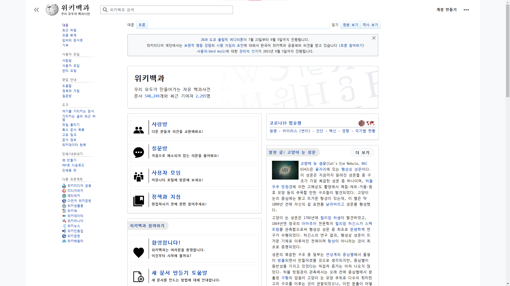
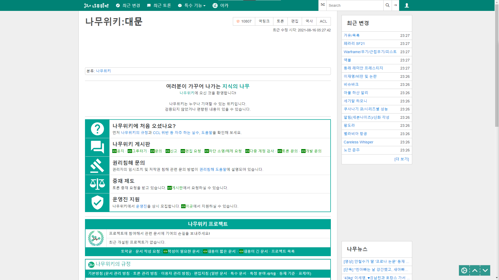

  


### 지원하는 사이트

__쿠팡 ([쿠팡! (coupang.com)](https://www.coupang.com/))__


- 스크래핑 가능 항목

  - 제품 이미지
  - 제품명
  - 가격
  - 별점
  - 해당 제품 판매 url

- 스크래핑 갯수

  이미지: 8개

  이외의 항목: 36개


__위키피디아([위키백과, 우리 모두의 백과사전 (wikipedia.org)](https://ko.wikipedia.org/wiki/위키백과:대문))__




검색어를 입력하면 본문 스크래핑 가능

Header별로 구분하여 저장


__나무위키([나무위키:대문 - 나무위키 (namu.wiki)](https://namu.wiki/w/나무위키:대문))__




검색어를 입력하면 본문 스크래핑 가능

Header별로 구분하여 저장


### Installation

__pip 설치__

```python
pip install koscrap
```

__사용__

```python
from koscrap import Coupang

c = Coupang('가방')
c.get_images() #=> [이미지 src 1, 이미지 src 2, ...]
```


### release

__1.0.0__

> - 쿠팡 스크래핑 적용


__1.1.0__

> - 나무위키, 위키피디아 스크래핑
> - 패키지명 koscrap으로 변경 및 pypi에 배포
> - 패키지 class형태로 구조 변경

